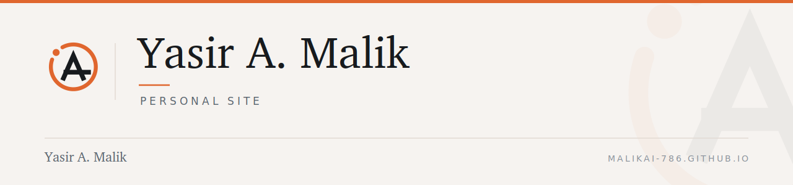

  <picture>
    <source media="(prefers-color-scheme: dark)" srcset=".github/brand/banner-dark.png">
    <source media="(prefers-color-scheme: light)" srcset=".github/brand/banner-light.png">
    
  </picture>

# Personal site

A static, dependency-free personal site — audit leadership, doctoral
research on auditor judgment, and AI governance.

| File | What it is |
| --- | --- |
| `index.html` | About |
| `books.html` | Reading |
| `style.css` | Layout, structure, and the original type scale |
| `brand.css` | The Reference Mark identity layer |

## Branding

Runs on the shared identity system. Because `style.css` is already
variable-driven, `brand.css` mostly re-points the site's own custom
properties — accent to ember `#E0662E`, neutrals to warm graphite and
paper, display face to Charter — rather than overriding rules.

Ember is 3.11:1 on paper, so links and body text use `--color-accent-ink`
(`#AD4317`), which clears 4.5:1 on every light surface in the system.

## Known gaps

The Google Scholar and Goodreads links still point at `YOUR_ID`
placeholders — drop the real profile IDs in and they're live. GitHub and
LinkedIn are wired up.

---

<b>Yasir A. Malik</b> · Audit · Risk · Governance — <a href="https://malikai-786.github.io">malikai-786.github.io</a> · <a href="https://linkedin.com/in/yasiramalik">LinkedIn</a>
